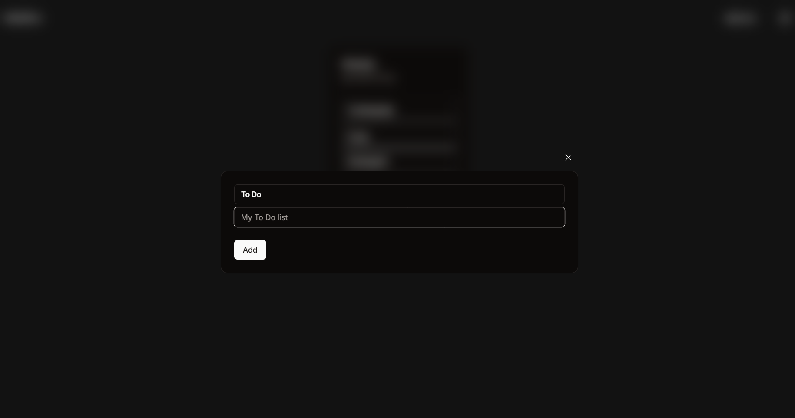
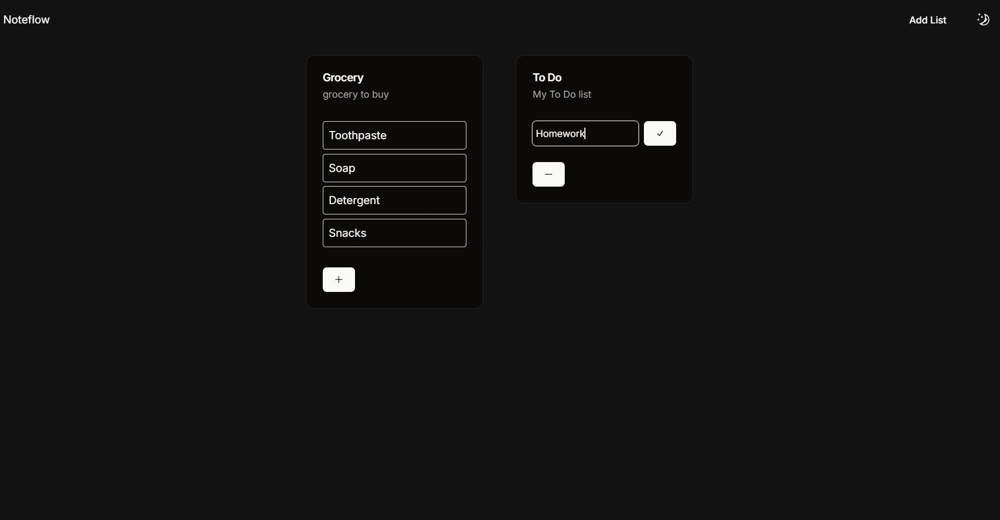
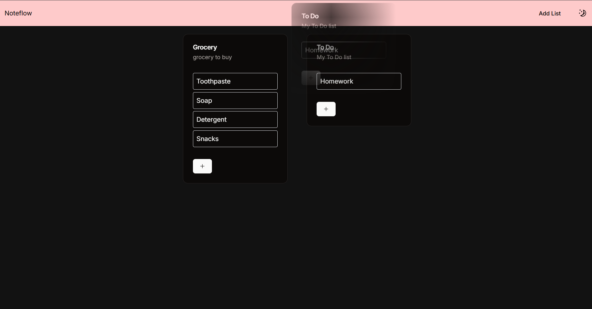
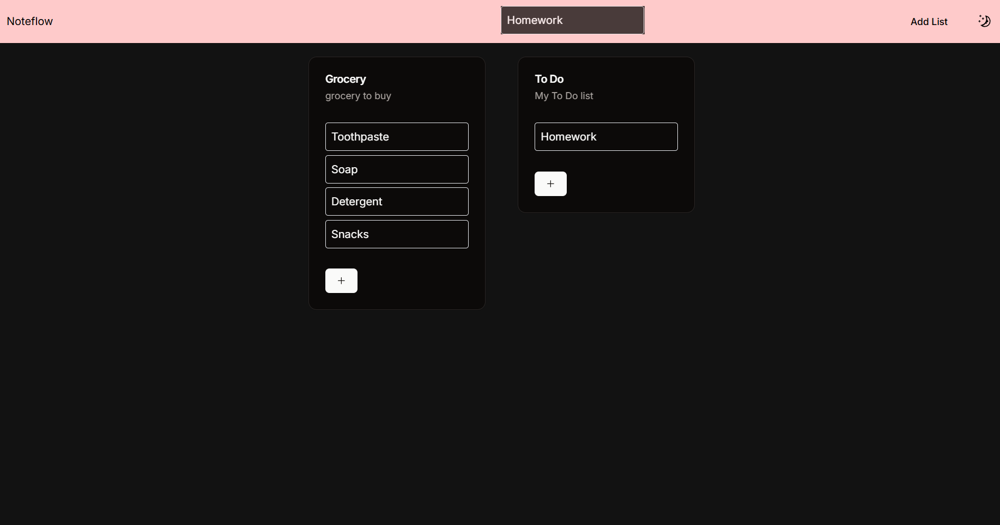

## About
A dynamic and intuitive todo list application allowing users to effortlessly manage tasks through drag-and-drop functionality. 

Try it out: https://note-flow-beta.vercel.app

## Features

### Add List


### Add Task


### Delete List/Task
#### List


#### Task


### Drag and Drop to rearrange/delete your lists and tasks


## How to run?

Use following commands:

```bash
git clone https://github.com/ayush-singh24/noteflow.git
cd noteflow
npm install
npm dev
```
